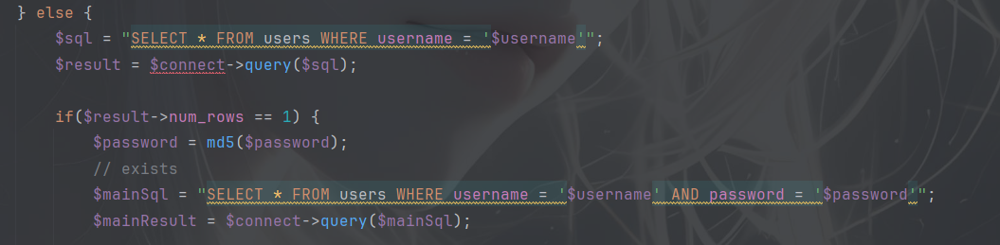
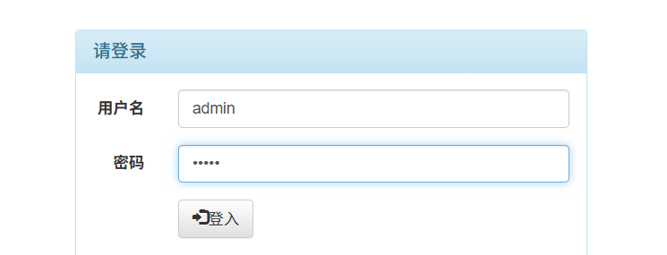
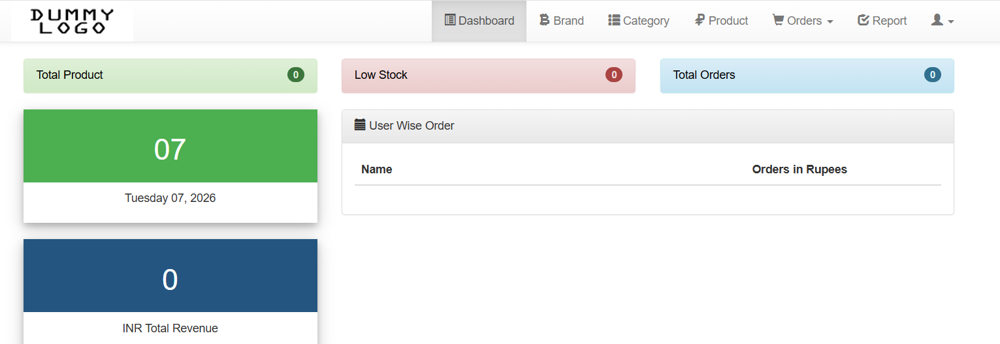
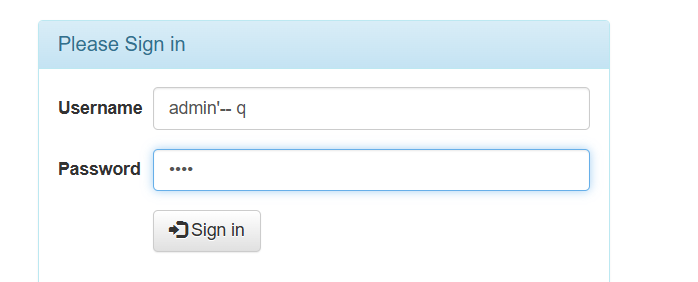
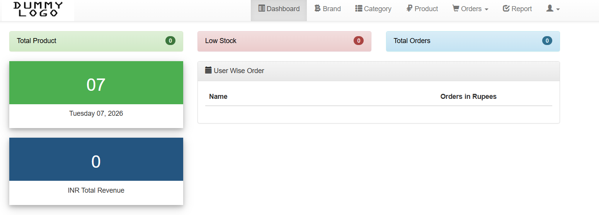

# Inventory Management System has sql injection in the index.php file

## supplier

[Inventory Management System In PHP With Source Code - Source Code & Projects](https://code-projects.org/inventory-management-system-in-php-with-source-code/)

## Vulnerability file

index.php

## describe

This code queries whether the current account exists from the database, and the username and password are not filtered in any way, nor are they normalized through function conversion, resulting in any password being able to log in to the account.

## POC

The account password is admin:admin,You can log in, but there is SQL injection here. You can log in only by knowing the account and any password.

Try the account password as admin'-- q:1234

## Result

Successfully logged in，And the database has not changed.
