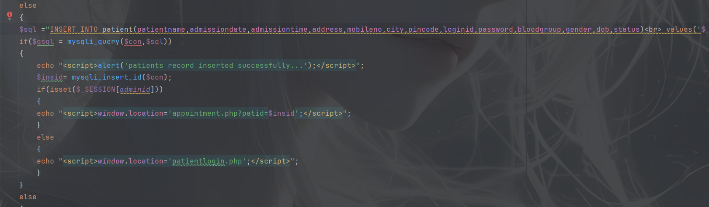
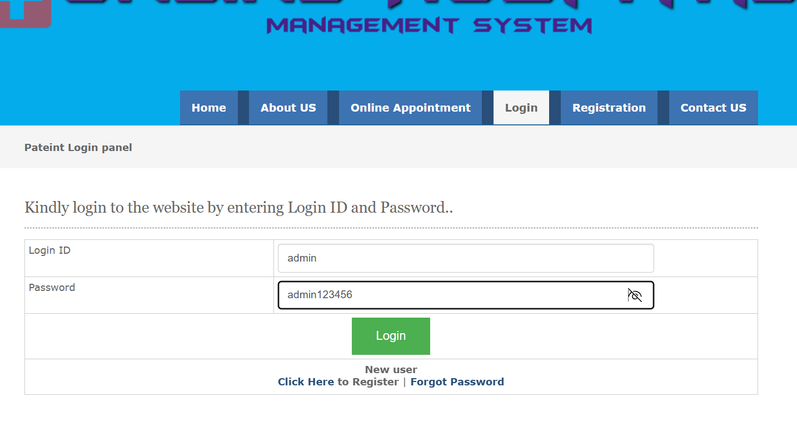
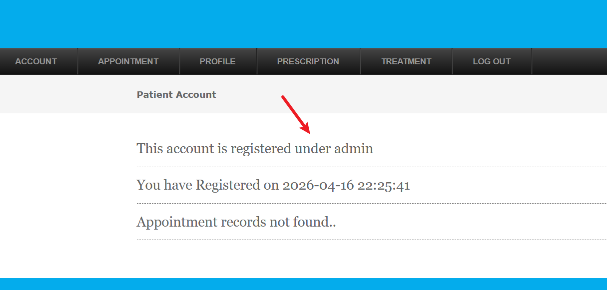
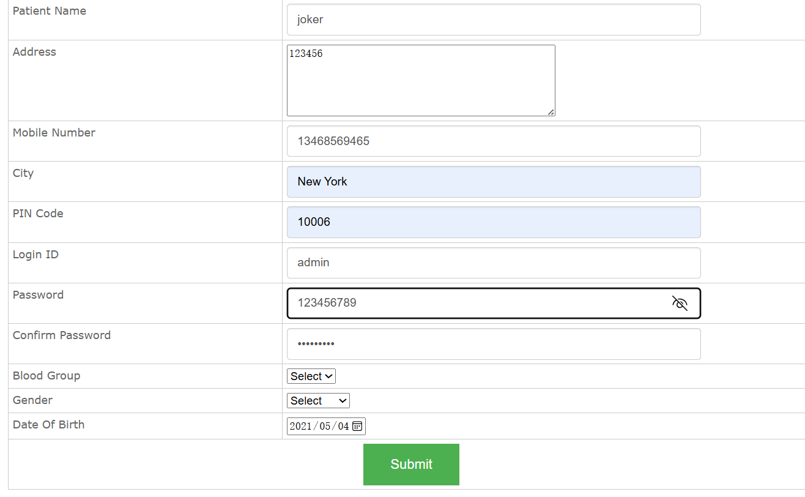
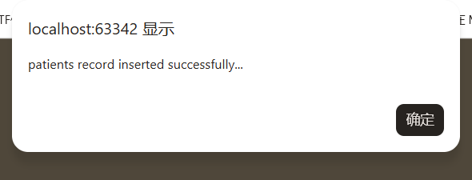
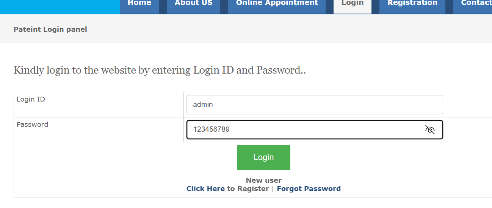
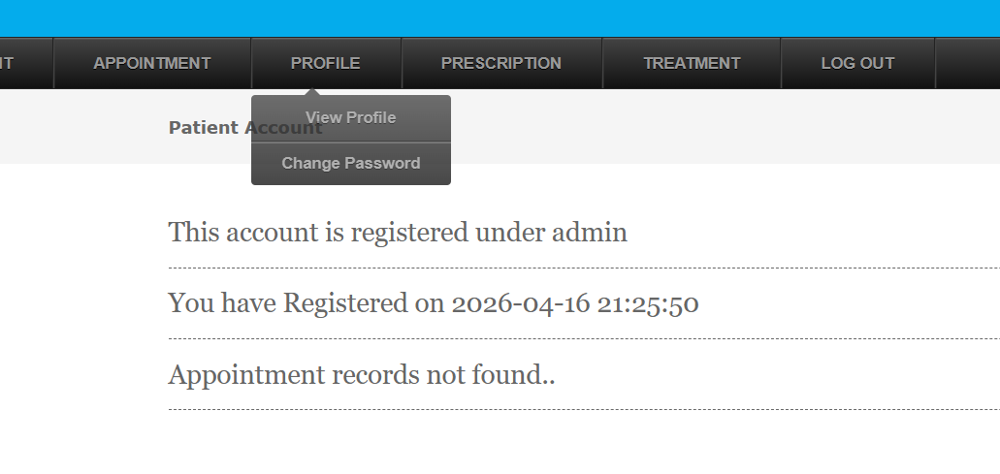

# Unauthorized Admin Privilege Access in Online Hospital Management System patient.php

## supplier

https://code-projects.org/online-hospital-management-system-in-php-with-source-code/

## Vulnerability file

patient.php

## describe

There is a critical **unauthorized administrator privilege escalation vulnerability** in the source code of this application. When registering a new account on the system, if an attacker enters the **username of an existing system administrator** in the username field of the registration form, and fills in any arbitrary password, the system will directly **overwrite the original administrator account's password** without performing any identity verification, permission check, or existence conflict judgment. After successfully completing the registration operation, the attacker can use the customized password and the administrator username to log in to the system smoothly, thereby **illegally obtaining full administrator privileges** without any authorization. This serious vulnerability allows unauthorized attackers to completely take over the administrator account, bypass all security access controls, and perform all sensitive operations reserved for system administrators.



Image does not show code rendered as text

```PHP
$sql ="INSERT INTO patient(patientname,admissiondate,admissiontime,address,mobileno,city,pincode,loginid,password,bloodgroup,gender,dob,status) values('$_POST[patientname]','$dt','$tim','$_POST[address]','$_POST[mobilenumber]','$_POST[city]','$_POST[pincode]','$_POST[loginid]','$_POST[password]','$_POST[select2]','$_POST[select3]','$_POST[dateofbirth]','Active')";
if($qsql = mysqli_query($con,$sql))
{
    echo "<script>alert('patients record inserted successfully...');</script>";
    $insid= mysqli_insert_id($con);
    if(isset($_SESSION[adminid]))
    {
    echo "<script>window.location='appointment.php?patid=$insid';</script>";   
    }
    else
    {
    echo "<script>window.location='patientlogin.php';</script>";   
    }     
}
else
{
    echo mysqli_error($con);
}
```

## POC









success



Login successful

## Result

Login successful

