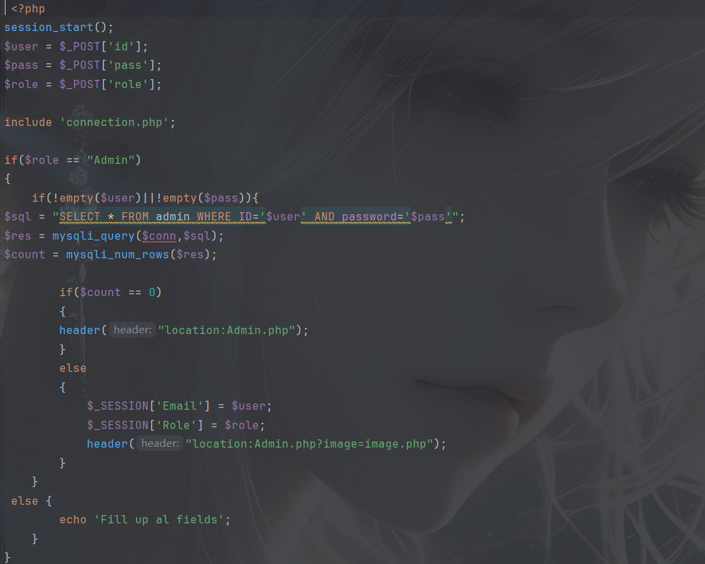
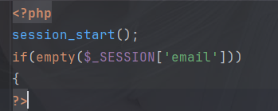
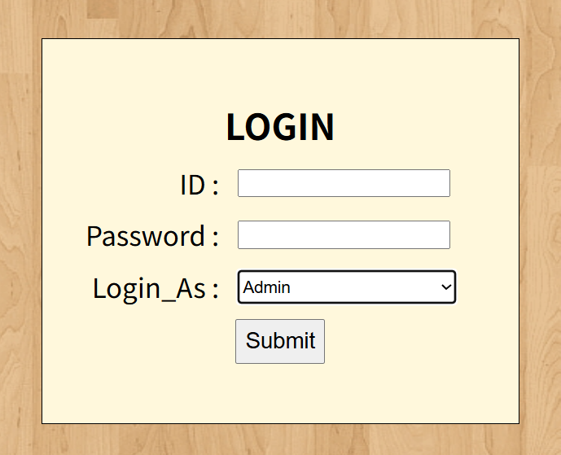

# Project Management System has sql injection in the chk.php file

## supplier

[Project Management System In PHP With Source Code - Source Code & Projects](https://code-projects.org/project-management-system-in-php-with-source-code/)

## Vulnerability file

chk.php

## describe

There is an authentication bypass vulnerability in the identity authentication module of the Project Management System. Since the system account existence pre-verification code is not strongly bound to the password verification logic, and input security processing is not performed, and the administrator account is automatically built-in by default when the administrator role is selected during the login process, an attacker can use any logic to use the account ID (such as: 'OR '1'='1' -- q) with any password to bypass identity authentication, successfully log in to any account in the system (including the highest authority administrator account), and illegally obtain the highest management authority of the system.

## POC

For the index.php login page, use the following code to confirm the login status

Select administrator login

Enter `1' OR '1'='1' -- q:123456` logged in successfully

## Result

Successfully logged in and the user is an administrator

